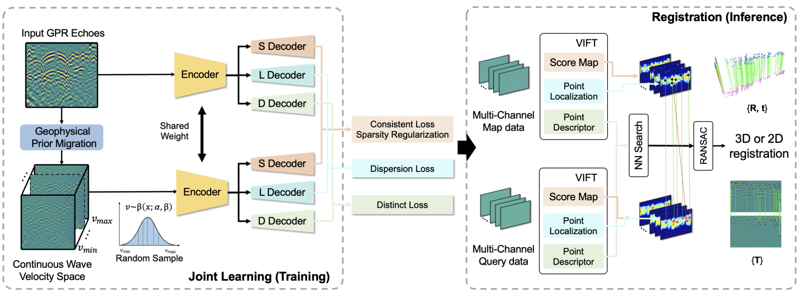

# VIFT: Velocity Space Representation Learning for GPR Keypoint Detection and Matching




**Official implementation** of the paper:  
> **Velocity Space Representation Learning for GPR Keypoint Detection and Matching**  
> *IEEE Transactions on Industrial Informatics (TII), 2026*

This repository provides a complete pipeline for unsupervised learning of robust keypoint detectors and descriptors tailored for **Ground Penetrating Radar (GPR)** imagery. By operating in the velocity space, our method achieves superior repeatability and matching accuracy under challenging subsurface conditions.


## 📁 Repository Structure

```text
Datasets/
├── MultiVelocity/                # Used for training
├── GROUNDED/                     # GROUNDED dataset for test
├── CMU/                          # CMU dataset for test
├── NUDT/                         # NUDT dataset for test

VIFT/
├── Unsuper/                      # Core unsupervised learning modules
│   └── configs/
│       └── Unsuper.yaml          # ★ Main configuration file (training & evaluation)
├── test/                         # Evaluation scripts
│   ├── evaluation_CMU.py         # Evaluation on CMU dataset
│   ├── evaluation_MIT.py         # Evaluation on MIT dataset
│   ├── evaluation_NUDT.py        # Evaluation on NUDT dataset
│   ├── detector_evaluation.py    # Detector performance metrics
│   ├── descriptor_evaluation.py  # Descriptor performance metrics
│   ├── export_kp_des.py          # Export keypoints & descriptors
│   └── test_vis_feature.py       # Visualize keypoints and matches
├── train.py                      # Training entry point
├── output/                       # Default output directory (logs, weights, results)
├── exp_excel/                    # Saved Excel tables for evaluation metrics
├── img/                          # Sample images
├── Animation/                    # Helper scripts for creating animations
├── requirements.txt              # Python dependencies
└── README.md                     # This file
```
## 📝 Datasets – Download and Location
The three benchmark datasets (CMU, MIT, NUDT) used in our paper can be downloaded from the following Baidu Netdisk link:
Link: https://pan.baidu.com/s/1_BHucEgRGyoPTDOylRMCSg
Extraction code: o4zp

After downloading, please organize the folders as follows (in the parent directory of this repository):

```text
../CMU/          # CMU dataset
../MIT/          # MIT dataset
../NUDT/         # NUDT dataset
```

## ⚙️ Installation
```text
pip install -r requirements.txt
```

## 🚀 Training
All training parameters are set in Unsuper/configs/Unsuper.yaml.
To start training with the default configuration, simply run:
```text
python train.py
```

## 📊 Evaluation
Run the evaluation scripts for each dataset:
```text
python test/evaluation_MIT.py
python test/evaluation_CMU.py
python test/evaluation_NUDT.py
```

## 📄 Citation
If you find this code useful in your research, please cite our paper:
```text
@article{VIFT26,
  author    = {Pengyu Zhang and Xieyuanli Chen and Liang Shen and Xulei Yang and Bharadwaj Veeravalli and Shijie Li and Tian Jin and Xiaotao Huang},
  title     = {Velocity Space Representation Learning for {GPR} Keypoint Detection and Matching},
  journal   = {IEEE Transactions on Industrial Informatics},
  volume    = {22},
  number    = {4},
  pages     = {2829--2840},
  year      = {2026},
  doi       = {10.1109/TII.2025.3647985}
}
```
